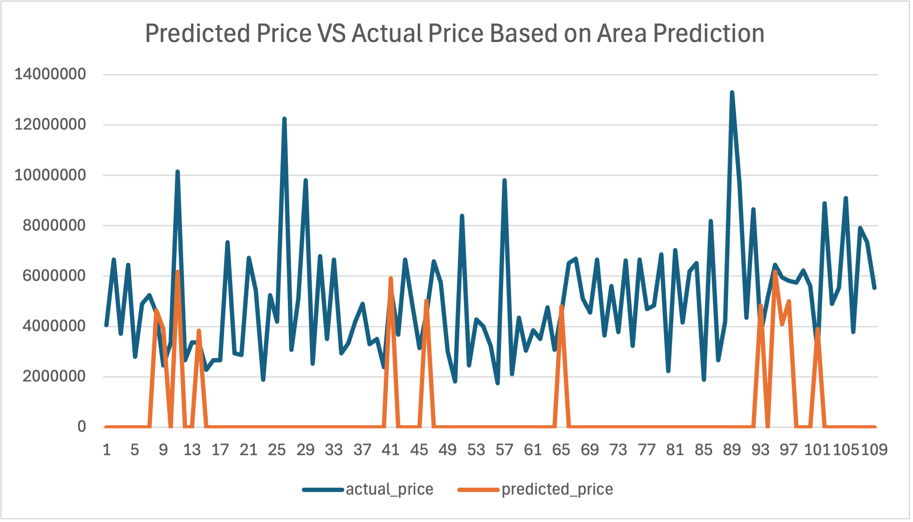
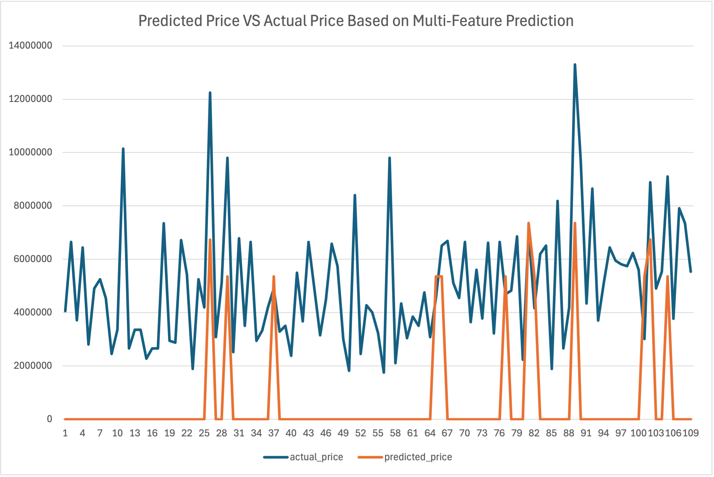

# 🏠 House Price Prediction with Linear Regression

This project explores **linear regression** as a machine learning technique for predicting house prices, starting with a **single-variable model** and extending to a **multiple-variable model**.

The goal is to understand **how feature selection impacts model performance**, and why incorporating multiple features leads to more accurate and reliable predictions.

---

## 📌 Project Overview

Two models are implemented and compared:

### 1️⃣ Single-Variable Linear Regression

* **Feature:** House area (square feet)
* **Target:** House price (USD)
* **Purpose:** Establish a baseline model and understand core ML concepts

### 2️⃣ Multiple-Variable Linear Regression

* **Features:**

  * Area
  * Number of bedrooms
  * Number of bathrooms
  * Number of stories
  * Parking availability
* **Purpose:** Improve prediction accuracy by capturing more real-world factors that influence house prices

---

## 🔍 Why This Comparison Matters

Real-world data is rarely explained by a single variable.

By comparing both models, this project demonstrates:

* How **single-feature models underfit complex problems**
* How **adding relevant features increases explanatory power**
* How evaluation metrics like **R² and MSE** help compare models objectively

---

## 📊 Visual Comparison of Actual vs Predicted Price

  
  

  <em>Left: Single-Variable Linear Regression &nbsp;&nbsp;&nbsp;&nbsp;&nbsp;&nbsp; | &nbsp;&nbsp; Right: Multiple-Variable Linear Regression</em>

As we can see, the multi-variable model closely matches the actual price plot line, confirming its superior predictive performance

---

## 🧠 Model Evaluation

Both models are evaluated using:

* **Mean Squared Error (MSE)**
  Measures the average squared difference between predicted and actual prices

* **R² Score**
  Indicates how much variance in house prices is explained by the model

### Key Findings

* The **single-variable model** explains a limited portion of price variance
* The **multiple-variable model** achieves:

  * Higher R² score
  * Lower MSE
  * Better generalization to unseen data

This confirms that **house prices are influenced by multiple factors**, not just size.

---

## 📁 Predictions Output

For both models:

* Predictions are generated on test data
* Results are exported to CSV files containing:

  * Input features
  * Actual prices
  * Predicted prices

This simulates how trained ML models are reused on unseen data in practice.

---

## 🧪 What This Project Covers

* Loading and inspecting CSV data with pandas
* Feature selection and data preparation
* Train/test splitting
* Training linear regression models with scikit-learn
* Interpreting coefficients for feature importance
* Model evaluation using MSE and R²
* Residual analysis to assess model assumptions
* Exporting predictions for external use

---

## ⚠️ Notes & Limitations

* This is an **educational project**, not a production-grade pricing model
* Important real-world features such as:

  * Location
  * Property condition
  * Neighborhood factors
    are not included
* Linear regression assumes linear relationships and constant variance

---

## 🚀 Technologies Used

* Python
* pandas
* matplotlib
* scikit-learn

---

## 🙌 Credits

Built with 💻 and ☕ by **@marcanjoul**
### Dataset

The dataset used in this project was sourced from Kaggle:

- **Name:** Real Estate Price Insights
- **Source:** Kaggle  
- **Link:** [https://www.kaggle.com/datasets/wardabilal/real-estate-price-insights]

The dataset was used for educational purposes to explore linear and multiple linear regression techniques.

---
